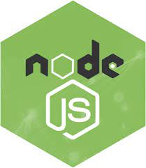

### Hi there, I'm Pampapathi Vandli👋

## I'm a Developer!

- 🌱 I’m currently working as a Software Engineer 🤠
- 🔭 I’m currently learning 
- ⚡ Fun fact: I love playing Cricket 🏏

### Connect with me:

[][linkedin]
[][instagram]

 

### Languages and Tools:

[linkedin]: https://www.linkedin.com/in/pampapathi-vandli-a88b37112/
[instagram]: https://www.instagram.com/pampavandli/?hl=en
